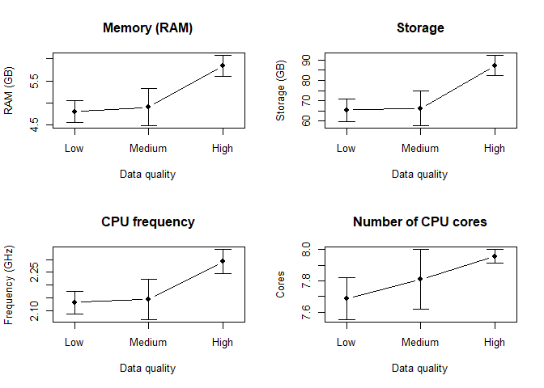

smartphone_quality_markdown
================
2024-03-04

Aim of this project is to use ordinal logistic regression to look for
associations between data quality and smartphone characteristics (age,
storage, ram etc).

Libraries:

``` r
library(readr)
library(dplyr)
library(ordinal)
library(tidymodels)
```

Load the data:

``` r
combined_data <- read_csv("../combined_data_version2.csv")
```

The variables:

- cores - how many cores in the CPU (used for parallel computing, it is
  good for opening several apps at the same time)

- storageX - disk size, X different storages depending on model etc.

- ramX - memory ram (it measures the smartphone capacity for handling
  multiple tasks)

- battery capacity - this is the physical battery capacity at
  manufacture measured in mAh, this decreases with the usage so we don’t
  really know the actual capacity when the patients got the app

- GHz_min and GHz_max - processor frequency (how strong is the cpu)

- release_year: should correlate with age of phone (transform to years
  since release)

- quality : main outcome, GOOD, BAD, MEDIUM

- foreground_app_version : bd4qol app version (categorical)

- os_version : version of android os (categorical)

- sdk: sdk app version (categorical)

- brand: phone brand

## Remove duplicates

Duplicates: multiple rows/patient ids. Will have price, can remove some
based on currency (only keep euro/pounds). Else, try version keeping
duplicates and compare to case where all duplicates are removed. Make 2
dataframes later

``` r
# Dataframe with only unique patient_ids
unique_patients <- combined_data %>%
  group_by(patient_id) %>%
  filter(n() == 1) %>%
  ungroup()

# Dataframe with duplicate patient_ids, filtered to include 'EUR' in price
duplicate_patients_eur <- combined_data %>%
  group_by(patient_id) %>%
  filter(n() > 1 & grepl("EUR", price)) %>%
  ungroup()

# Combining both dataframes
combined_data <- bind_rows(unique_patients, duplicate_patients_eur)
```

## Explore and transform data:

Quality

``` r
# Fix the order
combined_data <- combined_data %>% mutate(quality = factor(quality,
                                                           levels = c("BAD", "MEDIUM", "GOOD"))
                                          )
table(combined_data$quality)
```

    ## 
    ##    BAD MEDIUM   GOOD 
    ##     64     21     92

cores: most are 8 cores

``` r
table(combined_data$cores)
```

    ## 
    ##   4   8 
    ##   7 175

``` r
hist(combined_data$cores)
```

<!-- -->

battery cap:

``` r
hist(combined_data$battery_capacity)
```

<!-- -->

release_year: transform to years since release (2024-release_year)

``` r
table(combined_data$release_year)
```

    ## 
    ## 2016 2017 2018 2019 2020 2021 2022 2023 
    ##    1    6   15   53   29   37   28   13

``` r
combined_data <- combined_data %>% mutate(years_since_release = 2024-release_year)
hist(combined_data$years_since_release)
```

<!-- -->

foreground_app_version, brand, os_version, sdk: make into factors

``` r
combined_data <- combined_data %>% mutate(foreground_app_version = factor(foreground_app_version),
                                          brand = factor(brand),
                                          os_version = factor(os_version),
                                          sdk = factor(sdk))
```

GHz_min and GHz_max: keep as is

storage: can have different amounts depending on model; make a max and
min storage

``` r
combined_data <- combined_data %>%
  rowwise() %>%
  mutate(
    storage_min = min(c(storage1, storage2, storage3, storage4, storage5, storage6, storage7, storage8, storage9),na.rm=T), 
    storage_max = max(c(storage1, storage2, storage3, storage4, storage5, storage6, storage7, storage8, storage9),na.rm=T)
  ) %>%
  ungroup()

hist(combined_data$storage_min)
```

<!-- -->

``` r
hist(combined_data$storage_max)
```

<!-- -->

RAM: can depend on the model. Make a max, min, median, a binary (\<5
across min_max), a binary \<5 median

``` r
combined_data <- combined_data %>%
  rowwise() %>%
  mutate(
    ram_min = min(c(ram1, ram2, ram3, ram4, ram5, ram6, ram7, ram8, ram9),na.rm=T), 
    ram_max = max(c(ram1, ram2, ram3, ram4, ram5, ram6, ram7, ram8, ram9),na.rm=T),
    ram_median = median(c(ram1, ram2, ram3, ram4, ram5, ram6, ram7, ram8, ram9),na.rm=T)
  ) %>%
  ungroup()

hist(combined_data$ram_min)
```

<!-- -->

``` r
hist(combined_data$ram_max)
```

<!-- -->

``` r
hist(combined_data$ram_median)
```

<!-- -->

``` r
combined_data <- combined_data %>%
  mutate(
    ram_bin_minmax_larger_then_5 = if_else(ram_max > 5, true = 1,false = 0), 
    ram_bin_median_larger_then_5 = if_else(ram_median > 5, true = 1,false = 0)
  )

table(combined_data$ram_bin_minmax_larger_then_5)
```

    ## 
    ##   0   1 
    ##  56 126

``` r
table(combined_data$ram_bin_median_larger_then_5)
```

    ## 
    ##   0   1 
    ## 102  80

Make smaller dataset with only relevant variables & make no_duplicates
dataset:

``` r
data_reduced <- combined_data %>% dplyr::select(c(patient_id, quality, cores, battery_capacity, foreground_app_version,
                                           os_version, sdk, brand, GHz_max, GHz_min, years_since_release, storage_min,
                                           storage_max, ram_min, ram_max, ram_median, ram_bin_minmax_larger_then_5, ram_bin_median_larger_then_5))

data_reduced_noDups <- data_reduced %>%
  group_by(patient_id) %>%
  filter(n() == 1) %>%
  ungroup()
```

## Analyses: with duplicates

Ordered logistic regression (proportional odds logistic regression): too
many parameters, remove brand, sdk, os_version, foreground. Also scaled
all numeric variables.

``` r
mod_ord_logreg1_max <- clm(quality ~ scale(cores) + scale(battery_capacity) + scale(years_since_release) +
                          scale(GHz_max) + scale(storage_max) + scale(ram_max), data = data_reduced)
```

    ## Warning: Using formula(x) is deprecated when x is a character vector of length > 1.
    ##   Consider formula(paste(x, collapse = " ")) instead.

``` r
summary(mod_ord_logreg1_max)
```

    ## formula: 
    ## quality ~ scale(cores) + scale(battery_capacity) + scale(years_since_release) + scale(GHz_max) + scale(storage_max) + scale(ram_max)
    ## data:    data_reduced
    ## 
    ##  link  threshold nobs logLik  AIC    niter max.grad cond.H 
    ##  logit flexible  177  -164.37 344.74 5(1)  7.23e-13 2.1e+01
    ## 
    ## Coefficients:
    ##                            Estimate Std. Error z value Pr(>|z|)
    ## scale(cores)                0.21892    0.17671   1.239    0.215
    ## scale(battery_capacity)    -0.03191    0.20668  -0.154    0.877
    ## scale(years_since_release) -0.03213    0.21259  -0.151    0.880
    ## scale(GHz_max)             -0.06612    0.25606  -0.258    0.796
    ## scale(storage_max)          0.37800    0.28920   1.307    0.191
    ## scale(ram_max)              0.12286    0.25026   0.491    0.623
    ## 
    ## Threshold coefficients:
    ##             Estimate Std. Error z value
    ## BAD|MEDIUM  -0.61654    0.16265  -3.791
    ## MEDIUM|GOOD -0.09902    0.15591  -0.635
    ## (5 observations deleted due to missingness)

``` r
mod_ord_logreg1_min <- clm(quality ~ scale(cores) + scale(battery_capacity) + scale(years_since_release) +
                          scale(GHz_min) + scale(storage_min) + scale(ram_min), data = data_reduced)
```

    ## Warning: Using formula(x) is deprecated when x is a character vector of length > 1.
    ##   Consider formula(paste(x, collapse = " ")) instead.

``` r
summary(mod_ord_logreg1_min)
```

    ## formula: 
    ## quality ~ scale(cores) + scale(battery_capacity) + scale(years_since_release) + scale(GHz_min) + scale(storage_min) + scale(ram_min)
    ## data:    data_reduced
    ## 
    ##  link  threshold nobs logLik  AIC    niter max.grad cond.H 
    ##  logit flexible  177  -164.11 344.22 5(1)  4.41e-13 2.4e+01
    ## 
    ## Coefficients:
    ##                              Estimate Std. Error z value Pr(>|z|)  
    ## scale(cores)                0.2289456  0.1714298   1.336   0.1817  
    ## scale(battery_capacity)    -0.0204440  0.2041281  -0.100   0.9202  
    ## scale(years_since_release)  0.0006882  0.2163003   0.003   0.9975  
    ## scale(GHz_min)             -0.0562652  0.1786916  -0.315   0.7529  
    ## scale(storage_min)          0.5060467  0.2926203   1.729   0.0837 .
    ## scale(ram_min)             -0.0495659  0.2592623  -0.191   0.8484  
    ## ---
    ## Signif. codes:  0 '***' 0.001 '**' 0.01 '*' 0.05 '.' 0.1 ' ' 1
    ## 
    ## Threshold coefficients:
    ##             Estimate Std. Error z value
    ## BAD|MEDIUM  -0.60834    0.16240  -3.746
    ## MEDIUM|GOOD -0.08834    0.15560  -0.568
    ## (5 observations deleted due to missingness)

``` r
mod_ord_logreg1_median <- clm(quality ~ scale(cores) + scale(battery_capacity) + scale(years_since_release) +
                          scale(GHz_min) + scale(storage_min) + scale(ram_median), data = data_reduced)
```

    ## Warning: Using formula(x) is deprecated when x is a character vector of length > 1.
    ##   Consider formula(paste(x, collapse = " ")) instead.

``` r
summary(mod_ord_logreg1_median)
```

    ## formula: 
    ## quality ~ scale(cores) + scale(battery_capacity) + scale(years_since_release) + scale(GHz_min) + scale(storage_min) + scale(ram_median)
    ## data:    data_reduced
    ## 
    ##  link  threshold nobs logLik  AIC    niter max.grad cond.H 
    ##  logit flexible  177  -163.97 343.93 5(1)  2.14e-13 3.5e+01
    ## 
    ## Coefficients:
    ##                             Estimate Std. Error z value Pr(>|z|)
    ## scale(cores)                0.216160   0.172215   1.255    0.209
    ## scale(battery_capacity)    -0.005332   0.204494  -0.026    0.979
    ## scale(years_since_release)  0.002460   0.216305   0.011    0.991
    ## scale(GHz_min)             -0.076465   0.180615  -0.423    0.672
    ## scale(storage_min)          0.309751   0.335265   0.924    0.356
    ## scale(ram_median)           0.184164   0.324859   0.567    0.571
    ## 
    ## Threshold coefficients:
    ##             Estimate Std. Error z value
    ## BAD|MEDIUM  -0.60771    0.16238  -3.743
    ## MEDIUM|GOOD -0.08727    0.15561  -0.561
    ## (5 observations deleted due to missingness)

Nothing found here.

Try univariate models:

``` r
summary(clm(quality ~ scale(cores), data = data_reduced)) #almost sign
```

    ## formula: quality ~ scale(cores)
    ## data:    data_reduced
    ## 
    ##  link  threshold nobs logLik  AIC    niter max.grad cond.H 
    ##  logit flexible  177  -167.83 341.65 5(1)  1.69e-13 8.1e+00
    ## 
    ## Coefficients:
    ##              Estimate Std. Error z value Pr(>|z|)  
    ## scale(cores)   0.3131     0.1608   1.947   0.0516 .
    ## ---
    ## Signif. codes:  0 '***' 0.001 '**' 0.01 '*' 0.05 '.' 0.1 ' ' 1
    ## 
    ## Threshold coefficients:
    ##             Estimate Std. Error z value
    ## BAD|MEDIUM  -0.57563    0.15835  -3.635
    ## MEDIUM|GOOD -0.07503    0.15202  -0.494
    ## (5 observations deleted due to missingness)

``` r
summary(clm(quality ~ scale(battery_capacity), data = data_reduced))
```

    ## formula: quality ~ scale(battery_capacity)
    ## data:    data_reduced
    ## 
    ##  link  threshold nobs logLik  AIC    niter max.grad cond.H 
    ##  logit flexible  177  -169.69 345.39 4(1)  3.59e-10 8.2e+00
    ## 
    ## Coefficients:
    ##                         Estimate Std. Error z value Pr(>|z|)
    ## scale(battery_capacity)   0.1273     0.1468   0.867    0.386
    ## 
    ## Threshold coefficients:
    ##             Estimate Std. Error z value
    ## BAD|MEDIUM  -0.56628    0.15671  -3.614
    ## MEDIUM|GOOD -0.07503    0.15076  -0.498
    ## (5 observations deleted due to missingness)

``` r
summary(clm(quality ~ scale(years_since_release) , data = data_reduced))
```

    ## formula: quality ~ scale(years_since_release)
    ## data:    data_reduced
    ## 
    ##  link  threshold nobs logLik  AIC    niter max.grad cond.H 
    ##  logit flexible  177  -169.11 344.23 4(1)  3.83e-10 8.2e+00
    ## 
    ## Coefficients:
    ##                            Estimate Std. Error z value Pr(>|z|)
    ## scale(years_since_release)  -0.2020     0.1468  -1.377    0.169
    ## 
    ## Threshold coefficients:
    ##             Estimate Std. Error z value
    ## BAD|MEDIUM  -0.57220    0.15717  -3.641
    ## MEDIUM|GOOD -0.07811    0.15114  -0.517
    ## (5 observations deleted due to missingness)

``` r
summary(clm(quality ~ scale(GHz_max), data = data_reduced)) # sign
```

    ## formula: quality ~ scale(GHz_max)
    ## data:    data_reduced
    ## 
    ##  link  threshold nobs logLik  AIC    niter max.grad cond.H 
    ##  logit flexible  177  -166.98 339.96 4(1)  5.82e-08 8.1e+00
    ## 
    ## Coefficients:
    ##                Estimate Std. Error z value Pr(>|z|)  
    ## scale(GHz_max)   0.3720     0.1537    2.42   0.0155 *
    ## ---
    ## Signif. codes:  0 '***' 0.001 '**' 0.01 '*' 0.05 '.' 0.1 ' ' 1
    ## 
    ## Threshold coefficients:
    ##             Estimate Std. Error z value
    ## BAD|MEDIUM  -0.59326    0.15916  -3.727
    ## MEDIUM|GOOD -0.08917    0.15300  -0.583
    ## (5 observations deleted due to missingness)

``` r
summary(clm(quality ~ scale(GHz_min), data = data_reduced))
```

    ## formula: quality ~ scale(GHz_min)
    ## data:    data_reduced
    ## 
    ##  link  threshold nobs logLik  AIC    niter max.grad cond.H 
    ##  logit flexible  177  -169.12 344.24 4(1)  5.19e-10 8.2e+00
    ## 
    ## Coefficients:
    ##                Estimate Std. Error z value Pr(>|z|)
    ## scale(GHz_min)   0.1963     0.1427   1.375    0.169
    ## 
    ## Threshold coefficients:
    ##             Estimate Std. Error z value
    ## BAD|MEDIUM  -0.58035    0.15749  -3.685
    ## MEDIUM|GOOD -0.08611    0.15122  -0.569
    ## (5 observations deleted due to missingness)

``` r
summary(clm(quality ~ scale(storage_max), data = data_reduced)) # sign
```

    ## formula: quality ~ scale(storage_max)
    ## data:    data_reduced
    ## 
    ##  link  threshold nobs logLik  AIC    niter max.grad cond.H 
    ##  logit flexible  177  -165.54 337.09 5(1)  4.65e-12 8.5e+00
    ## 
    ## Coefficients:
    ##                    Estimate Std. Error z value Pr(>|z|)   
    ## scale(storage_max)   0.4902     0.1748   2.805  0.00504 **
    ## ---
    ## Signif. codes:  0 '***' 0.001 '**' 0.01 '*' 0.05 '.' 0.1 ' ' 1
    ## 
    ## Threshold coefficients:
    ##             Estimate Std. Error z value
    ## BAD|MEDIUM   -0.6192     0.1617  -3.829
    ## MEDIUM|GOOD  -0.1089     0.1553  -0.701
    ## (5 observations deleted due to missingness)

``` r
summary(clm(quality ~ scale(storage_min), data = data_reduced)) # sign
```

    ## formula: quality ~ scale(storage_min)
    ## data:    data_reduced
    ## 
    ##  link  threshold nobs logLik  AIC    niter max.grad cond.H 
    ##  logit flexible  177  -165.13 336.27 5(1)  8.58e-14 8.1e+00
    ## 
    ## Coefficients:
    ##                    Estimate Std. Error z value Pr(>|z|)   
    ## scale(storage_min)   0.4917     0.1643   2.993  0.00276 **
    ## ---
    ## Signif. codes:  0 '***' 0.001 '**' 0.01 '*' 0.05 '.' 0.1 ' ' 1
    ## 
    ## Threshold coefficients:
    ##             Estimate Std. Error z value
    ## BAD|MEDIUM  -0.60974    0.16129  -3.780
    ## MEDIUM|GOOD -0.09498    0.15462  -0.614
    ## (5 observations deleted due to missingness)

``` r
summary(clm(quality ~ scale(ram_max), data = data_reduced)) #sign
```

    ## formula: quality ~ scale(ram_max)
    ## data:    data_reduced
    ## 
    ##  link  threshold nobs logLik  AIC    niter max.grad cond.H 
    ##  logit flexible  177  -166.29 338.57 4(1)  8.24e-08 8.0e+00
    ## 
    ## Coefficients:
    ##                Estimate Std. Error z value Pr(>|z|)   
    ## scale(ram_max)   0.4142     0.1548   2.676  0.00746 **
    ## ---
    ## Signif. codes:  0 '***' 0.001 '**' 0.01 '*' 0.05 '.' 0.1 ' ' 1
    ## 
    ## Threshold coefficients:
    ##             Estimate Std. Error z value
    ## BAD|MEDIUM  -0.60134    0.16009  -3.756
    ## MEDIUM|GOOD -0.09213    0.15341  -0.601
    ## (5 observations deleted due to missingness)

``` r
summary(clm(quality ~ scale(ram_min), data = data_reduced)) #sign
```

    ## formula: quality ~ scale(ram_min)
    ## data:    data_reduced
    ## 
    ##  link  threshold nobs logLik  AIC    niter max.grad cond.H 
    ##  logit flexible  177  -166.96 339.92 4(1)  8.65e-08 8.1e+00
    ## 
    ## Coefficients:
    ##                Estimate Std. Error z value Pr(>|z|)  
    ## scale(ram_min)   0.3675     0.1511   2.433    0.015 *
    ## ---
    ## Signif. codes:  0 '***' 0.001 '**' 0.01 '*' 0.05 '.' 0.1 ' ' 1
    ## 
    ## Threshold coefficients:
    ##             Estimate Std. Error z value
    ## BAD|MEDIUM  -0.59091    0.15927  -3.710
    ## MEDIUM|GOOD -0.08586    0.15293  -0.561
    ## (5 observations deleted due to missingness)

``` r
summary(clm(quality ~ scale(ram_median), data = data_reduced)) #sign
```

    ## formula: quality ~ scale(ram_median)
    ## data:    data_reduced
    ## 
    ##  link  threshold nobs logLik  AIC    niter max.grad cond.H 
    ##  logit flexible  177  -165.30 336.61 5(1)  2.86e-14 8.1e+00
    ## 
    ## Coefficients:
    ##                   Estimate Std. Error z value Pr(>|z|)   
    ## scale(ram_median)   0.4747     0.1608   2.953  0.00315 **
    ## ---
    ## Signif. codes:  0 '***' 0.001 '**' 0.01 '*' 0.05 '.' 0.1 ' ' 1
    ## 
    ## Threshold coefficients:
    ##             Estimate Std. Error z value
    ## BAD|MEDIUM  -0.60743    0.16103  -3.772
    ## MEDIUM|GOOD -0.09442    0.15448  -0.611
    ## (5 observations deleted due to missingness)

``` r
summary(clm(quality ~ scale(ram_bin_minmax_larger_then_5), data = data_reduced)) #sign
```

    ## formula: quality ~ scale(ram_bin_minmax_larger_then_5)
    ## data:    data_reduced
    ## 
    ##  link  threshold nobs logLik  AIC    niter max.grad cond.H 
    ##  logit flexible  177  -167.52 341.05 4(1)  8.15e-10 8.1e+00
    ## 
    ## Coefficients:
    ##                                     Estimate Std. Error z value Pr(>|z|)  
    ## scale(ram_bin_minmax_larger_then_5)   0.3229     0.1436   2.249   0.0245 *
    ## ---
    ## Signif. codes:  0 '***' 0.001 '**' 0.01 '*' 0.05 '.' 0.1 ' ' 1
    ## 
    ## Threshold coefficients:
    ##             Estimate Std. Error z value
    ## BAD|MEDIUM  -0.59119    0.15876  -3.724
    ## MEDIUM|GOOD -0.08874    0.15236  -0.582
    ## (5 observations deleted due to missingness)

``` r
summary(clm(quality ~ scale(ram_bin_median_larger_then_5), data = data_reduced)) #sign
```

    ## formula: quality ~ scale(ram_bin_median_larger_then_5)
    ## data:    data_reduced
    ## 
    ##  link  threshold nobs logLik  AIC    niter max.grad cond.H 
    ##  logit flexible  177  -167.50 341.00 4(1)  2.12e-09 8.1e+00
    ## 
    ## Coefficients:
    ##                                     Estimate Std. Error z value Pr(>|z|)  
    ## scale(ram_bin_median_larger_then_5)   0.3327     0.1480   2.248   0.0246 *
    ## ---
    ## Signif. codes:  0 '***' 0.001 '**' 0.01 '*' 0.05 '.' 0.1 ' ' 1
    ## 
    ## Threshold coefficients:
    ##             Estimate Std. Error z value
    ## BAD|MEDIUM  -0.58580    0.15864  -3.693
    ## MEDIUM|GOOD -0.08349    0.15243  -0.548
    ## (5 observations deleted due to missingness)

``` r
summary(clm(quality ~ sdk, data = data_reduced))
```

    ## formula: quality ~ sdk
    ## data:    data_reduced
    ## 
    ##  link  threshold nobs logLik  AIC    niter max.grad cond.H 
    ##  logit flexible  177  -162.49 342.99 4(1)  8.10e-08 3.2e+03
    ## 
    ## Coefficients:
    ##       Estimate Std. Error z value Pr(>|z|)
    ## sdk26 -0.79234    1.67197  -0.474    0.636
    ## sdk28 -0.33082    1.62123  -0.204    0.838
    ## sdk29 -0.21778    1.45352  -0.150    0.881
    ## sdk30  0.85322    1.48378   0.575    0.565
    ## sdk31 -0.06981    1.46925  -0.048    0.962
    ## sdk33  0.94934    1.45207   0.654    0.513
    ## sdk34  0.79234    1.88553   0.420    0.674
    ## 
    ## Threshold coefficients:
    ##             Estimate Std. Error z value
    ## BAD|MEDIUM   -0.2647     1.4277  -0.185
    ## MEDIUM|GOOD   0.2647     1.4277   0.185
    ## (5 observations deleted due to missingness)

``` r
summary(clm(quality ~ os_version, data = data_reduced)) #sign
```

    ## formula: quality ~ os_version
    ## data:    data_reduced
    ## 
    ##  link  threshold nobs logLik  AIC    niter max.grad cond.H 
    ##  logit flexible  177  -162.49 342.99 4(1)  8.10e-08 3.7e+02
    ## 
    ## Coefficients:
    ##                 Estimate Std. Error z value Pr(>|z|)   
    ## os_version11      1.0710     0.4942   2.167  0.03021 * 
    ## os_version12      0.1480     0.4483   0.330  0.74131   
    ## os_version13      1.1671     0.3888   3.002  0.00268 **
    ## os_version14      1.0101     1.2640   0.799  0.42422   
    ## os_version7.1.1   0.2178     1.4535   0.150  0.88090   
    ## os_version8.0.0  -0.5746     0.9151  -0.628  0.53010   
    ## os_version9      -0.1130     0.8189  -0.138  0.89021   
    ## ---
    ## Signif. codes:  0 '***' 0.001 '**' 0.01 '*' 0.05 '.' 0.1 ' ' 1
    ## 
    ## Threshold coefficients:
    ##             Estimate Std. Error z value
    ## BAD|MEDIUM  -0.04689    0.28244  -0.166
    ## MEDIUM|GOOD  0.48246    0.28504   1.693
    ## (5 observations deleted due to missingness)

``` r
summary(clm(quality ~ foreground_app_version, data = data_reduced))
```

    ## Warning: (1) Hessian is numerically singular: parameters are not uniquely determined 
    ## In addition: Absolute convergence criterion was met, but relative criterion was not met

    ## formula: quality ~ foreground_app_version
    ## data:    data_reduced
    ## 
    ##  link  threshold nobs logLik  AIC    niter max.grad cond.H 
    ##  logit flexible  176  -166.97 341.95 19(1) 2.73e-09 5.9e+11
    ## 
    ## Coefficients:
    ##                             Estimate Std. Error z value Pr(>|z|)
    ## foreground_app_version2.14 2.103e+01         NA      NA       NA
    ## foreground_app_version2.6  7.213e-06         NA      NA       NA
    ## 
    ## Threshold coefficients:
    ##             Estimate Std. Error z value
    ## BAD|MEDIUM     20.41         NA      NA
    ## MEDIUM|GOOD    20.91         NA      NA
    ## (6 observations deleted due to missingness)

Try logistic regression where outcome is binary: good (1) or not good
(0)

``` r
data_reduced <- data_reduced %>% mutate(quality_good = if_else(quality == "GOOD", true = 1, false = 0))
summary(glm(quality_good ~ scale(cores) + scale(battery_capacity) + scale(years_since_release) +
                          scale(GHz_max) + scale(storage_max) + scale(ram_max), data = data_reduced, family=binomial()))
```

    ## 
    ## Call:
    ## glm(formula = quality_good ~ scale(cores) + scale(battery_capacity) + 
    ##     scale(years_since_release) + scale(GHz_max) + scale(storage_max) + 
    ##     scale(ram_max), family = binomial(), data = data_reduced)
    ## 
    ## Deviance Residuals: 
    ##     Min       1Q   Median       3Q      Max  
    ## -2.0437  -1.1520   0.6419   1.1500   1.8905  
    ## 
    ## Coefficients:
    ##                            Estimate Std. Error z value Pr(>|z|)
    ## (Intercept)                 0.08316    0.15823   0.526    0.599
    ## scale(cores)                0.29945    0.22465   1.333    0.183
    ## scale(battery_capacity)    -0.19504    0.22481  -0.868    0.386
    ## scale(years_since_release) -0.12716    0.22944  -0.554    0.579
    ## scale(GHz_max)             -0.14295    0.27254  -0.524    0.600
    ## scale(storage_max)          0.41706    0.30811   1.354    0.176
    ## scale(ram_max)              0.19798    0.26802   0.739    0.460
    ## 
    ## (Dispersion parameter for binomial family taken to be 1)
    ## 
    ##     Null deviance: 245.10  on 176  degrees of freedom
    ## Residual deviance: 231.61  on 170  degrees of freedom
    ##   (5 observations deleted due to missingness)
    ## AIC: 245.61
    ## 
    ## Number of Fisher Scoring iterations: 4

Try logistic regression where outcome is binary: bad (1) or not bad (0)

``` r
data_reduced <- data_reduced %>% mutate(quality_bad = if_else(quality == "BAD", true = 1, false = 0))
summary(glm(quality_bad ~ scale(cores) + scale(battery_capacity) + scale(years_since_release) +
                          scale(GHz_max) + scale(storage_max) + scale(ram_max), data = data_reduced, family=binomial()))
```

    ## 
    ## Call:
    ## glm(formula = quality_bad ~ scale(cores) + scale(battery_capacity) + 
    ##     scale(years_since_release) + scale(GHz_max) + scale(storage_max) + 
    ##     scale(ram_max), family = binomial(), data = data_reduced)
    ## 
    ## Deviance Residuals: 
    ##     Min       1Q   Median       3Q      Max  
    ## -1.6146  -0.9410  -0.8337   1.3414   1.8747  
    ## 
    ## Coefficients:
    ##                            Estimate Std. Error z value Pr(>|z|)    
    ## (Intercept)                -0.59003    0.16108  -3.663 0.000249 ***
    ## scale(cores)               -0.19465    0.17999  -1.081 0.279492    
    ## scale(battery_capacity)    -0.11858    0.22799  -0.520 0.602964    
    ## scale(years_since_release) -0.02364    0.23430  -0.101 0.919642    
    ## scale(GHz_max)             -0.04351    0.27520  -0.158 0.874369    
    ## scale(storage_max)         -0.25866    0.31655  -0.817 0.413870    
    ## scale(ram_max)             -0.02681    0.27137  -0.099 0.921288    
    ## ---
    ## Signif. codes:  0 '***' 0.001 '**' 0.01 '*' 0.05 '.' 0.1 ' ' 1
    ## 
    ## (Dispersion parameter for binomial family taken to be 1)
    ## 
    ##     Null deviance: 231.63  on 176  degrees of freedom
    ## Residual deviance: 224.13  on 170  degrees of freedom
    ##   (5 observations deleted due to missingness)
    ## AIC: 238.13
    ## 
    ## Number of Fisher Scoring iterations: 4

## Analyses: without duplicates

Ordered logistic regression (proportional odds logistic regression): too
many parameters, remove brand, sdk, os_version, foreground. Also scaled
all numeric variables.

``` r
mod_ord_logreg1_max_noDups <- clm(quality ~ scale(cores) + scale(battery_capacity) + scale(years_since_release) +
                          scale(GHz_max) + scale(storage_max) + scale(ram_max), data = data_reduced_noDups)
```

    ## Warning: Using formula(x) is deprecated when x is a character vector of length > 1.
    ##   Consider formula(paste(x, collapse = " ")) instead.

``` r
summary(mod_ord_logreg1_max_noDups)
```

    ## formula: 
    ## quality ~ scale(cores) + scale(battery_capacity) + scale(years_since_release) + scale(GHz_max) + scale(storage_max) + scale(ram_max)
    ## data:    data_reduced_noDups
    ## 
    ##  link  threshold nobs logLik  AIC    niter max.grad cond.H 
    ##  logit flexible  145  -122.11 260.23 11(1) 1.06e-12 3.6e+01
    ## 
    ## Coefficients:
    ##                            Estimate Std. Error z value Pr(>|z|)
    ## scale(cores)                0.27811    0.19897   1.398    0.162
    ## scale(battery_capacity)    -0.07147    0.24845  -0.288    0.774
    ## scale(years_since_release)  0.05480    0.24833   0.221    0.825
    ## scale(GHz_max)             -0.05920    0.30407  -0.195    0.846
    ## scale(storage_max)          0.38646    0.32956   1.173    0.241
    ## scale(ram_max)              0.11026    0.28803   0.383    0.702
    ## 
    ## Threshold coefficients:
    ##             Estimate Std. Error z value
    ## BAD|MEDIUM   -0.5992     0.1802  -3.325
    ## MEDIUM|GOOD  -0.2935     0.1746  -1.681
    ## (2 observations deleted due to missingness)

``` r
mod_ord_logreg1_min_noDups <- clm(quality ~ scale(cores) + scale(battery_capacity) + scale(years_since_release) +
                          scale(GHz_min) + scale(storage_min) + scale(ram_min), data = data_reduced_noDups)
```

    ## Warning: Using formula(x) is deprecated when x is a character vector of length > 1.
    ##   Consider formula(paste(x, collapse = " ")) instead.

``` r
summary(mod_ord_logreg1_min_noDups)
```

    ## formula: 
    ## quality ~ scale(cores) + scale(battery_capacity) + scale(years_since_release) + scale(GHz_min) + scale(storage_min) + scale(ram_min)
    ## data:    data_reduced_noDups
    ## 
    ##  link  threshold nobs logLik  AIC    niter max.grad cond.H 
    ##  logit flexible  145  -122.69 261.38 5(2)  9.95e-07 3.6e+01
    ## 
    ## Coefficients:
    ##                            Estimate Std. Error z value Pr(>|z|)
    ## scale(cores)                0.29434    0.19292   1.526    0.127
    ## scale(battery_capacity)    -0.09681    0.25169  -0.385    0.701
    ## scale(years_since_release)  0.04251    0.24655   0.172    0.863
    ## scale(GHz_min)              0.02515    0.21740   0.116    0.908
    ## scale(storage_min)          0.42821    0.31424   1.363    0.173
    ## scale(ram_min)             -0.10541    0.28142  -0.375    0.708
    ## 
    ## Threshold coefficients:
    ##             Estimate Std. Error z value
    ## BAD|MEDIUM   -0.5796     0.1780  -3.257
    ## MEDIUM|GOOD  -0.2757     0.1725  -1.598
    ## (2 observations deleted due to missingness)

``` r
mod_ord_logreg1_median_noDups <- clm(quality ~ scale(cores) + scale(battery_capacity) + scale(years_since_release) +
                          scale(GHz_min) + scale(storage_min) + scale(ram_median), data = data_reduced_noDups)
```

    ## Warning: Using formula(x) is deprecated when x is a character vector of length > 1.
    ##   Consider formula(paste(x, collapse = " ")) instead.

``` r
summary(mod_ord_logreg1_median_noDups)
```

    ## formula: 
    ## quality ~ scale(cores) + scale(battery_capacity) + scale(years_since_release) + scale(GHz_min) + scale(storage_min) + scale(ram_median)
    ## data:    data_reduced_noDups
    ## 
    ##  link  threshold nobs logLik  AIC    niter max.grad cond.H 
    ##  logit flexible  145  -122.27 260.53 11(1) 8.98e-11 5.9e+01
    ## 
    ## Coefficients:
    ##                             Estimate Std. Error z value Pr(>|z|)
    ## scale(cores)                0.265862   0.193684   1.373    0.170
    ## scale(battery_capacity)    -0.055571   0.253455  -0.219    0.826
    ## scale(years_since_release)  0.062085   0.247251   0.251    0.802
    ## scale(GHz_min)             -0.007567   0.219382  -0.034    0.972
    ## scale(storage_min)          0.043972   0.371531   0.118    0.906
    ## scale(ram_median)           0.363260   0.373662   0.972    0.331
    ## 
    ## Threshold coefficients:
    ##             Estimate Std. Error z value
    ## BAD|MEDIUM   -0.5807     0.1784  -3.256
    ## MEDIUM|GOOD  -0.2754     0.1729  -1.593
    ## (2 observations deleted due to missingness)

Nothing found here.

Try univariate models:

``` r
summary(clm(quality ~ scale(cores), data = data_reduced_noDups)) #sign
```

    ## formula: quality ~ scale(cores)
    ## data:    data_reduced_noDups
    ## 
    ##  link  threshold nobs logLik  AIC    niter max.grad cond.H 
    ##  logit flexible  145  -124.46 254.92 5(2)  7.63e-07 1.4e+01
    ## 
    ## Coefficients:
    ##              Estimate Std. Error z value Pr(>|z|)  
    ## scale(cores)   0.3568     0.1786   1.997   0.0458 *
    ## ---
    ## Signif. codes:  0 '***' 0.001 '**' 0.01 '*' 0.05 '.' 0.1 ' ' 1
    ## 
    ## Threshold coefficients:
    ##             Estimate Std. Error z value
    ## BAD|MEDIUM   -0.5616     0.1752  -3.204
    ## MEDIUM|GOOD  -0.2645     0.1700  -1.556
    ## (2 observations deleted due to missingness)

``` r
summary(clm(quality ~ scale(battery_capacity), data = data_reduced_noDups))
```

    ## formula: quality ~ scale(battery_capacity)
    ## data:    data_reduced_noDups
    ## 
    ##  link  threshold nobs logLik  AIC    niter max.grad cond.H 
    ##  logit flexible  145  -126.75 259.50 5(2)  2.44e-11 1.4e+01
    ## 
    ## Coefficients:
    ##                         Estimate Std. Error z value Pr(>|z|)
    ## scale(battery_capacity)  0.06424    0.16598   0.387    0.699
    ## 
    ## Threshold coefficients:
    ##             Estimate Std. Error z value
    ## BAD|MEDIUM   -0.5521     0.1725  -3.200
    ## MEDIUM|GOOD  -0.2639     0.1676  -1.574
    ## (2 observations deleted due to missingness)

``` r
summary(clm(quality ~ scale(years_since_release) , data = data_reduced_noDups))
```

    ## formula: quality ~ scale(years_since_release)
    ## data:    data_reduced_noDups
    ## 
    ##  link  threshold nobs logLik  AIC    niter max.grad cond.H 
    ##  logit flexible  145  -126.61 259.22 5(2)  3.19e-11 1.4e+01
    ## 
    ## Coefficients:
    ##                            Estimate Std. Error z value Pr(>|z|)
    ## scale(years_since_release)  -0.1063     0.1625  -0.654    0.513
    ## 
    ## Threshold coefficients:
    ##             Estimate Std. Error z value
    ## BAD|MEDIUM   -0.5519     0.1727  -3.196
    ## MEDIUM|GOOD  -0.2632     0.1678  -1.569
    ## (2 observations deleted due to missingness)

``` r
summary(clm(quality ~ scale(GHz_max), data = data_reduced_noDups)) # sign
```

    ## formula: quality ~ scale(GHz_max)
    ## data:    data_reduced_noDups
    ## 
    ##  link  threshold nobs logLik  AIC    niter max.grad cond.H 
    ##  logit flexible  145  -124.33 254.66 5(2)  4.91e-08 1.4e+01
    ## 
    ## Coefficients:
    ##                Estimate Std. Error z value Pr(>|z|)  
    ## scale(GHz_max)   0.3752     0.1722   2.179   0.0293 *
    ## ---
    ## Signif. codes:  0 '***' 0.001 '**' 0.01 '*' 0.05 '.' 0.1 ' ' 1
    ## 
    ## Threshold coefficients:
    ##             Estimate Std. Error z value
    ## BAD|MEDIUM   -0.5718     0.1756  -3.256
    ## MEDIUM|GOOD  -0.2749     0.1706  -1.612
    ## (2 observations deleted due to missingness)

``` r
summary(clm(quality ~ scale(GHz_min), data = data_reduced_noDups))
```

    ## formula: quality ~ scale(GHz_min)
    ## data:    data_reduced_noDups
    ## 
    ##  link  threshold nobs logLik  AIC    niter max.grad cond.H 
    ##  logit flexible  145  -126.05 258.11 5(2)  1.45e-10 1.4e+01
    ## 
    ## Coefficients:
    ##                Estimate Std. Error z value Pr(>|z|)
    ## scale(GHz_min)   0.2030     0.1638    1.24    0.215
    ## 
    ## Threshold coefficients:
    ##             Estimate Std. Error z value
    ## BAD|MEDIUM   -0.5599     0.1735  -3.227
    ## MEDIUM|GOOD  -0.2689     0.1684  -1.597
    ## (2 observations deleted due to missingness)

``` r
summary(clm(quality ~ scale(storage_max), data = data_reduced_noDups)) # sign
```

    ## formula: quality ~ scale(storage_max)
    ## data:    data_reduced_noDups
    ## 
    ##  link  threshold nobs logLik  AIC    niter max.grad cond.H 
    ##  logit flexible  145  -123.48 252.96 6(2)  1.41e-12 1.5e+01
    ## 
    ## Coefficients:
    ##                    Estimate Std. Error z value Pr(>|z|)  
    ## scale(storage_max)   0.4763     0.1967   2.421   0.0155 *
    ## ---
    ## Signif. codes:  0 '***' 0.001 '**' 0.01 '*' 0.05 '.' 0.1 ' ' 1
    ## 
    ## Threshold coefficients:
    ##             Estimate Std. Error z value
    ## BAD|MEDIUM   -0.6001     0.1786  -3.361
    ## MEDIUM|GOOD  -0.3006     0.1733  -1.734
    ## (2 observations deleted due to missingness)

``` r
summary(clm(quality ~ scale(storage_min), data = data_reduced_noDups)) # sign
```

    ## formula: quality ~ scale(storage_min)
    ## data:    data_reduced_noDups
    ## 
    ##  link  threshold nobs logLik  AIC    niter max.grad cond.H 
    ##  logit flexible  145  -124.14 254.29 5(2)  3.77e-07 1.4e+01
    ## 
    ## Coefficients:
    ##                    Estimate Std. Error z value Pr(>|z|)  
    ## scale(storage_min)   0.4039     0.1812   2.229   0.0258 *
    ## ---
    ## Signif. codes:  0 '***' 0.001 '**' 0.01 '*' 0.05 '.' 0.1 ' ' 1
    ## 
    ## Threshold coefficients:
    ##             Estimate Std. Error z value
    ## BAD|MEDIUM   -0.5752     0.1762  -3.265
    ## MEDIUM|GOOD  -0.2770     0.1709  -1.620
    ## (2 observations deleted due to missingness)

``` r
summary(clm(quality ~ scale(ram_max), data = data_reduced_noDups)) #sign
```

    ## formula: quality ~ scale(ram_max)
    ## data:    data_reduced_noDups
    ## 
    ##  link  threshold nobs logLik  AIC    niter max.grad cond.H 
    ##  logit flexible  145  -124.20 254.40 5(2)  4.68e-08 1.4e+01
    ## 
    ## Coefficients:
    ##                Estimate Std. Error z value Pr(>|z|)  
    ## scale(ram_max)   0.3909     0.1751   2.232   0.0256 *
    ## ---
    ## Signif. codes:  0 '***' 0.001 '**' 0.01 '*' 0.05 '.' 0.1 ' ' 1
    ## 
    ## Threshold coefficients:
    ##             Estimate Std. Error z value
    ## BAD|MEDIUM   -0.5756     0.1760  -3.270
    ## MEDIUM|GOOD  -0.2773     0.1707  -1.625
    ## (2 observations deleted due to missingness)

``` r
summary(clm(quality ~ scale(ram_min), data = data_reduced_noDups)) #almost sign
```

    ## formula: quality ~ scale(ram_min)
    ## data:    data_reduced_noDups
    ## 
    ##  link  threshold nobs logLik  AIC    niter max.grad cond.H 
    ##  logit flexible  145  -125.32 256.64 5(2)  1.21e-08 1.4e+01
    ## 
    ## Coefficients:
    ##                Estimate Std. Error z value Pr(>|z|)  
    ## scale(ram_min)   0.2878     0.1686   1.707   0.0879 .
    ## ---
    ## Signif. codes:  0 '***' 0.001 '**' 0.01 '*' 0.05 '.' 0.1 ' ' 1
    ## 
    ## Threshold coefficients:
    ##             Estimate Std. Error z value
    ## BAD|MEDIUM   -0.5605     0.1743  -3.215
    ## MEDIUM|GOOD  -0.2669     0.1693  -1.577
    ## (2 observations deleted due to missingness)

``` r
summary(clm(quality ~ scale(ram_median), data = data_reduced_noDups)) #sign
```

    ## formula: quality ~ scale(ram_median)
    ## data:    data_reduced_noDups
    ## 
    ##  link  threshold nobs logLik  AIC    niter max.grad cond.H 
    ##  logit flexible  145  -123.40 252.80 5(2)  8.26e-07 1.4e+01
    ## 
    ## Coefficients:
    ##                   Estimate Std. Error z value Pr(>|z|)  
    ## scale(ram_median)   0.4567     0.1821   2.508   0.0121 *
    ## ---
    ## Signif. codes:  0 '***' 0.001 '**' 0.01 '*' 0.05 '.' 0.1 ' ' 1
    ## 
    ## Threshold coefficients:
    ##             Estimate Std. Error z value
    ## BAD|MEDIUM   -0.5808     0.1772  -3.278
    ## MEDIUM|GOOD  -0.2801     0.1719  -1.630
    ## (2 observations deleted due to missingness)

``` r
summary(clm(quality ~ scale(ram_bin_minmax_larger_then_5), data = data_reduced_noDups)) #sign
```

    ## formula: quality ~ scale(ram_bin_minmax_larger_then_5)
    ## data:    data_reduced_noDups
    ## 
    ##  link  threshold nobs logLik  AIC    niter max.grad cond.H 
    ##  logit flexible  145  -124.77 255.54 5(2)  4.68e-10 1.4e+01
    ## 
    ## Coefficients:
    ##                                     Estimate Std. Error z value Pr(>|z|)  
    ## scale(ram_bin_minmax_larger_then_5)   0.3304     0.1633   2.023    0.043 *
    ## ---
    ## Signif. codes:  0 '***' 0.001 '**' 0.01 '*' 0.05 '.' 0.1 ' ' 1
    ## 
    ## Threshold coefficients:
    ##             Estimate Std. Error z value
    ## BAD|MEDIUM   -0.5661     0.1749  -3.236
    ## MEDIUM|GOOD  -0.2703     0.1698  -1.592
    ## (2 observations deleted due to missingness)

``` r
summary(clm(quality ~ scale(ram_bin_median_larger_then_5), data = data_reduced_noDups)) #almost sign
```

    ## formula: quality ~ scale(ram_bin_median_larger_then_5)
    ## data:    data_reduced_noDups
    ## 
    ##  link  threshold nobs logLik  AIC    niter max.grad cond.H 
    ##  logit flexible  145  -125.10 256.20 5(2)  2.28e-09 1.4e+01
    ## 
    ## Coefficients:
    ##                                     Estimate Std. Error z value Pr(>|z|)  
    ## scale(ram_bin_median_larger_then_5)   0.3079     0.1671   1.842   0.0655 .
    ## ---
    ## Signif. codes:  0 '***' 0.001 '**' 0.01 '*' 0.05 '.' 0.1 ' ' 1
    ## 
    ## Threshold coefficients:
    ##             Estimate Std. Error z value
    ## BAD|MEDIUM   -0.5620     0.1745  -3.220
    ## MEDIUM|GOOD  -0.2676     0.1695  -1.579
    ## (2 observations deleted due to missingness)

``` r
summary(clm(quality ~ os_version, data = data_reduced_noDups))
```

    ## formula: quality ~ os_version
    ## data:    data_reduced_noDups
    ## 
    ##  link  threshold nobs logLik  AIC    niter max.grad cond.H 
    ##  logit flexible  145  -122.79 263.58 5(2)  1.22e-08 6.3e+02
    ## 
    ## Coefficients:
    ##                 Estimate Std. Error z value Pr(>|z|)
    ## os_version11      0.5179     0.6055   0.855    0.392
    ## os_version12     -0.1833     0.5842  -0.314    0.754
    ## os_version13      0.7461     0.5151   1.448    0.147
    ## os_version14      0.6442     1.3034   0.494    0.621
    ## os_version7.1.1  -0.1031     1.4844  -0.069    0.945
    ## os_version8.0.0  -0.8504     0.9725  -0.874    0.382
    ## os_version9      -0.4142     0.8824  -0.469    0.639
    ## 
    ## Threshold coefficients:
    ##             Estimate Std. Error z value
    ## BAD|MEDIUM  -0.25497    0.44092  -0.578
    ## MEDIUM|GOOD  0.04874    0.44038   0.111
    ## (2 observations deleted due to missingness)

Try logistic regression where outcome is binary: good (1) or not good
(0)

``` r
data_reduced_noDups <- data_reduced_noDups %>% mutate(quality_good = if_else(quality == "GOOD", true = 1, false = 0))
summary(glm(quality_good ~ scale(cores) + scale(battery_capacity) + scale(years_since_release) +
                          scale(GHz_max) + scale(storage_max) + scale(ram_max), data = data_reduced_noDups, family=binomial()))
```

    ## 
    ## Call:
    ## glm(formula = quality_good ~ scale(cores) + scale(battery_capacity) + 
    ##     scale(years_since_release) + scale(GHz_max) + scale(storage_max) + 
    ##     scale(ram_max), family = binomial(), data = data_reduced_noDups)
    ## 
    ## Deviance Residuals: 
    ##     Min       1Q   Median       3Q      Max  
    ## -1.9736  -1.2323   0.7021   1.0902   1.8618  
    ## 
    ## Coefficients:
    ##                            Estimate Std. Error z value Pr(>|z|)
    ## (Intercept)                 0.27635    0.17728   1.559    0.119
    ## scale(cores)                0.39416    0.25071   1.572    0.116
    ## scale(battery_capacity)    -0.07746    0.25690  -0.302    0.763
    ## scale(years_since_release)  0.06782    0.25944   0.261    0.794
    ## scale(GHz_max)             -0.16527    0.32037  -0.516    0.606
    ## scale(storage_max)          0.51241    0.35142   1.458    0.145
    ## scale(ram_max)              0.09424    0.29911   0.315    0.753
    ## 
    ## (Dispersion parameter for binomial family taken to be 1)
    ## 
    ##     Null deviance: 198.52  on 144  degrees of freedom
    ## Residual deviance: 187.49  on 138  degrees of freedom
    ##   (2 observations deleted due to missingness)
    ## AIC: 201.49
    ## 
    ## Number of Fisher Scoring iterations: 4

Try logistic regression where outcome is binary: bad (1) or not bad (0)

``` r
data_reduced_noDups <- data_reduced_noDups %>% mutate(quality_bad = if_else(quality == "BAD", true = 1, false = 0))
summary(glm(quality_bad ~ scale(cores) + scale(battery_capacity) + scale(years_since_release) +
                          scale(GHz_max) + scale(storage_max) + scale(ram_max), data = data_reduced_noDups, family=binomial()))
```

    ## 
    ## Call:
    ## glm(formula = quality_bad ~ scale(cores) + scale(battery_capacity) + 
    ##     scale(years_since_release) + scale(GHz_max) + scale(storage_max) + 
    ##     scale(ram_max), family = binomial(), data = data_reduced_noDups)
    ## 
    ## Deviance Residuals: 
    ##     Min       1Q   Median       3Q      Max  
    ## -1.6658  -0.9758  -0.7986   1.3241   1.8875  
    ## 
    ## Coefficients:
    ##                            Estimate Std. Error z value Pr(>|z|)   
    ## (Intercept)                -0.57609    0.17839  -3.229  0.00124 **
    ## scale(cores)               -0.23245    0.20177  -1.152  0.24930   
    ## scale(battery_capacity)     0.10831    0.26079   0.415  0.67790   
    ## scale(years_since_release)  0.04696    0.26274   0.179  0.85816   
    ## scale(GHz_max)             -0.12261    0.32439  -0.378  0.70545   
    ## scale(storage_max)         -0.14661    0.34817  -0.421  0.67370   
    ## scale(ram_max)             -0.11395    0.30332  -0.376  0.70717   
    ## ---
    ## Signif. codes:  0 '***' 0.001 '**' 0.01 '*' 0.05 '.' 0.1 ' ' 1
    ## 
    ## (Dispersion parameter for binomial family taken to be 1)
    ## 
    ##     Null deviance: 190.39  on 144  degrees of freedom
    ## Residual deviance: 183.40  on 138  degrees of freedom
    ##   (2 observations deleted due to missingness)
    ## AIC: 197.4
    ## 
    ## Number of Fisher Scoring iterations: 4

## Make plots to show effects

From the analyses it seems that ram and storage are the main ones with
cores and GHz as a maybe, but not able to specify which one specifically

``` r
par(mfrow=c(2,2))
sciplot::lineplot.CI(quality, ram_median, data = data_reduced, main = "Memory (RAM)", xlab="Data quality", ylab="RAM (GB)")
sciplot::lineplot.CI(quality, storage_min, data = data_reduced, main = "Storage", xlab="Data quality", ylab="Storage (GB)")
sciplot::lineplot.CI(quality, GHz_max, data = data_reduced, main ="CPU frequency", xlab="Data quality", ylab="GHz")
sciplot::lineplot.CI(quality, cores, data = data_reduced, main = "Number of CPU cores", xlab="Data quality", ylab="Cores")
```

<!-- -->

``` r
par(mfrow=c(1,1))
```
